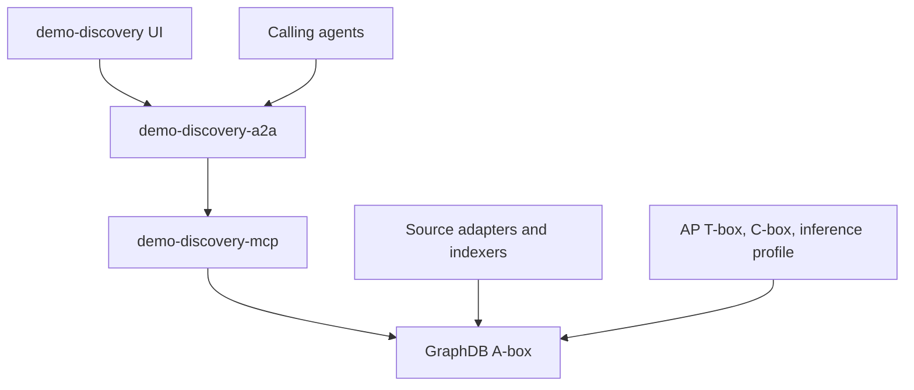

# Discovery A2A Architecture and Design

**Status:** design guidance.
**Scope:** `apps/registry` as the UI-facing discovery agent over `demo-discovery-mcp` and the GraphDB A-box.
**Related:** [`README.md`](../README.md), [`discovery-mcp`](../../discovery-mcp/README.md), [`discovery-knowledge-graph-architecture.md`](../../../docs/architecture/discovery-knowledge-graph-architecture.md), [`spec 279`](../../../specs/279-agent-discovery-registry-kit.md).

## Decision

Do not build another authoritative agent registry. Build a provenance-preserving, policy-aware discovery resolver that federates observations from many registries, cards, chains, indexes, and marketplaces, then explains every result.

The app boundary remains:



`demo-discovery-a2a` owns user-facing orchestration, intent normalization, policy selection, ranking, and explanations. It does not own GraphDB credentials, source ingestion, external registry publication, custody authority, payment settlement, or private vault access.

## Landscape Takeaway

The market is splitting agent discovery into seven planes:

- Identity and naming: A2A cards, ANS, ERC-8004, HCS UAIDs, DIDs, domains.
- Profile and protocol cards: A2A Agent Cards, OASF records, HCS profiles, NANDA AgentFacts.
- Capabilities: A2A skills, MCP tools, OASF taxonomies, Agent Skills packages, HCS skills.
- Offerings: callable endpoints, schemas, terms, price, SLA, availability, and transport.
- Registries and indexes: MCP Registry, AGNTCY Directory, ERC-8004 subgraphs, HOL brokers.
- Trust and outcomes: reputation, validation, task history, attestations, liveness, exposure signals.
- Authority and settlement: AP delegations, entitlements, x402, escrow, OAuth, and payment systems.

Discovery should observe and explain these planes. It must not collapse them into one "registry truth" or infer authority from visibility.

## Core Domain Model

Use these concepts consistently in graph records, MCP payloads, A2A task outputs, and UI explanations:

- `Agent`: the actor or service identity, anchored by Smart Agent address when AP-native.
- `Endpoint`: one current way to reach an agent.
- `CapabilityClaim`: a source assertion that an agent can do something.
- `Offering`: a callable capability with protocol, endpoint, schemas, terms, SLA, availability, price, and evidence.
- `SkillArtifact`: an installable package or procedural asset such as a `SKILL.md` folder.
- `SourceObservation`: one registry, card, chain, DNS record, probe, marketplace, or indexer report at a point in time.
- `EvidencePath`: the facts and bindings that justify a claim or score.
- `Authority`: permission to invoke, spend, decrypt, or act. Discovery references authority requirements but does not decide them.

Two missing first-class concepts in the current demo are `Offering` and `SourceObservation`. They should be added before ranking becomes product-significant.

```ts
export interface Offering {
  offeringKey: string;
  agentKey: string;
  capabilityTerms: string[];
  protocol: "a2a" | "mcp" | "http" | "other";
  endpointRef: string;
  inputSchema?: unknown;
  outputSchema?: unknown;
  priceTerms?: unknown;
  sla?: unknown;
  availability?: EndpointAvailability;
  evidence: EvidenceRef[];
}

export interface SourceObservation {
  source: string;
  nativeId: string;
  sourceEvent?: string;
  sourceSequence?: string;
  sourceBlock?: string;
  fetchedAt: string;
  observedAt?: string;
  expiresAt?: string;
  schemaVersion?: string;
  verificationStatus:
    | "verified"
    | "selfAsserted"
    | "invalid"
    | "missing"
    | "error"
    | "stale"
    | "restricted"
    | "conflicting";
  canonicalIds: string[];
  artifactHash?: string;
}
```

Conflicting observations are preserved, not overwritten. Policy decides which observations are accepted for a specific query.

## Endpoint Decision

Use both A2A and demo convenience surfaces, backed by one application service:

- `GET /.well-known/agent-card.json`: public A2A Agent Card.
- `POST /api/a2a`: canonical A2A task transport target.
- `POST /discover`: versioned demo/UI convenience shim.
- Authenticated extended card: restricted operational and admin skills.
- Internal service binding to MCP: production A2A-to-MCP communication.

`POST /discover` must not develop separate business semantics. It translates into the same `discover_agents` handler and returns a simplified projection of the canonical result.

Document the distinction this way:

- A2A protocol compatibility: public card and task transport.
- AP A2A task profile: AP delegation, mandate, receipt, and authority extensions.
- Discovery REST shim: convenience API, not the A2A protocol itself.

## Public Skills

The public skill surface should be small but expressive:

- `discover_agents`: actor-level search by intent, skill, geography, policy, and evidence requirements.
- `discover_offerings`: callable service search by schema, transport, price, SLA, availability, and evidence.
- `explain_agent`: identity, profile, trust vector, conflicts, and evidence paths.
- `explain_offering`: exact endpoint, callable contract, terms, and verification state.
- `match_intent`: resolve an intent and rank eligible agents or offerings.
- `compare_agents`: side-by-side evidence and trust comparison.
- `resolve_agent_identity`: resolve aliases, domains, DIDs, UAIDs, ERC IDs, and native registry IDs.
- `verify_agent_card`: verify syntax, signature, endpoint binding, and observed freshness.
- `get_discovery_receipt`: retrieve a reproducible result record.
- `describe_ontology_term`: explain AP and mapped external ontology terms.
- `list_discovery_shapes`: expose SHACL shape and conformance summaries.

Admin skills must not appear in the unauthenticated public card. Use an authenticated extended card or a separate admin agent/card for:

- `admin_get_source_health`
- `admin_reindex_source`
- `admin_quarantine_observation`
- `admin_scan_public_exposure`
- `admin_explain_finding`
- `admin_get_graph_health`

## Discovery MCP Contract

`demo-discovery-mcp` should stay deterministic and graph-centered. It should return raw candidate features and evidence rather than final opaque rankings.

Recommended MCP tools:

- `search_candidates`
- `get_agent`
- `get_offering`
- `resolve_identifiers`
- `verify_artifact`
- `get_evidence_subgraph`
- `get_graph_snapshot`
- `get_source_watermarks`
- `get_shacl_report`
- `describe_term`
- `list_shapes`
- `admin_list_findings`
- `admin_get_finding`
- `admin_get_source_health`
- `admin_request_reindex`

`search_candidates` should accept resolved intent, required/excluded capabilities, geography, protocol constraints, commercial constraints, trust policy, snapshot, and limit. It should return feature evidence for agents and offerings, including identity bindings, capability claims, validation signals, outcome signals, exposure signals, endpoint observations, and conflicts.

## Discovery Receipt

Every material match should be reproducible:

```ts
export interface DiscoveryReceipt {
  receiptId: string;
  requestHash: string;
  resolvedIntentHash: string;
  graphSnapshotId: string;
  sourceWatermarks: SourceWatermark[];
  inferenceProfile: { id: string; version: string };
  trustPolicy: { id: string; version: string };
  rankingProfile: { id: string; version: string };
  candidateFeatureHashes: string[];
  exclusions: Exclusion[];
  generatedAt: string;
  signature?: string;
}
```

Same request, same graph snapshot, same inference profile, same trust policy, and same ranking profile should reproduce the same result. This follows the best practice used by deterministic trust-scoring systems: signal collection, inference, policy, and ranking must be versioned separately.

## Ranking Model

Do not collapse trust into one score. Return component values:

```ts
export interface CandidateScores {
  relevance: number;
  evidenceCoverage: number;
  freshness: number;
  operationalConfidence: number;
  outcomeConfidence: number;
  overallConfidence: number;
  trustVector: {
    identity?: number;
    integrity?: number;
    capability?: number;
    operational?: number;
    behavioral?: number;
    safety?: number;
    economic?: number;
  };
}
```

Pipeline:

1. Resolve intent.
2. Apply mandatory eligibility gates.
3. Match capabilities and offering schemas.
4. Assess identity and endpoint binding.
5. Assess freshness and availability.
6. Evaluate validations and observed outcomes.
7. Apply exposure and safety policy.
8. Rank eligible candidates.
9. Generate evidence paths and exclusions.
10. Hash or sign the receipt.

Missing signals and inapplicable signals are different. A missing Hedera signal should not penalize a non-Hedera agent. A missing conformance test can penalize an agent only when the selected policy requires that test.

## Source Adapter Order

Phase 1: standards foundation.

- Native A2A cards.
- MCP Registry.
- OASF conversion and taxonomy mapping.
- Local AP registry-kit/profile artifacts.
- Signed-card verification.
- Snapshot and receipt support.

Phase 2: decentralized identity and trust.

- ERC-8004 contracts and Agent0 subgraphs.
- HCS registry/profile/UAID observations.
- ANS DNS and event-stream observations.
- HCS-style deterministic scoring snapshots.
- Skill artifact registries.

Phase 3: offerings and commerce.

- x402 Bazaar.
- Virtuals ACP offerings and outcomes.
- Olas services/tools and deliveries.
- Fetch Almanac registrations.
- Masumi availability and registry records.
- OpenAPI-style manifests.
- Nevermined payment/access metadata.
- ERC-8183 job outcomes.

Phase 4: active assurance.

- Endpoint reachability.
- Card and registry binding verification.
- Schema conformance.
- Safe synthetic invocation.
- Performance observations.
- Validation/evaluation receipts.
- Exposure findings.
- Conflict and anomaly detection.

Draft or external protocols must preserve their source version in every observation. They are source adapters and ontology mappings, not AP-native authority semantics.

## Security Controls

Discovery is a security-sensitive inference process, not a database lookup.

Metadata poisoning controls:

- Treat cards, registry entries, marketplace metadata, and skill descriptions as untrusted input.
- Sanitize display fields and URLs.
- Restrict fetched schemes and private network targets.
- Defend against SSRF and redirect abuse.
- Hash raw artifacts before transformation.
- Preserve raw and normalized forms.
- Record which source supplied each field.
- Sandbox active validation.
- Quarantine suspicious observations rather than silently deleting them.

Skill supply-chain controls:

- Record artifact hash, publisher, source repository, version, license, signature status, yanked/deprecated status, scan status, scripts, dependencies, and execution status.
- Never execute arbitrary skill code during a public search request.
- Do not treat possession of a skill package as proof of competence.

Identity collision controls:

- Do not merge records only because they share a display name, endpoint hostname, wallet, provider name, or skill label.
- Require a defensible binding path for canonical identity equivalence.
- Use `possiblySameAs` or `claimedSameAs` for weaker links; reserve `sameAs` for true equivalence.

Absence semantics:

- Prefer `notObservedInSnapshot` over global "not found."
- Include snapshot ID, sources searched, source watermarks, restricted sources omitted, failed adapters, and query constraints.
- Do not perform hidden fallback scans when the graph has no answer.

## Best-Practice Principles

- Discovery is not authorization.
- Registry visibility is not operator identity.
- Skill claims are not competence.
- Signed cards prove integrity/control, not permission to invoke.
- Offerings are often the real search target, not agents.
- Trust is a vector with evidence, policy, freshness, and confidence.
- Source observations are immutable facts; rankings are policy-bound interpretations.
- Public and admin graphs must remain separate.
- External standards are inputs and mappings, not Ring 0 dependencies.

## Acceptance Criteria

- `POST /discover` is documented as a shim over canonical skill handling.
- `/api/a2a` is specified as the canonical A2A task endpoint before production use.
- Public and authenticated/extended agent cards have separate skill disclosure.
- `Offering`, `SourceObservation`, and `DiscoveryReceipt` appear in wire and graph design.
- Search results include evidence paths, source watermarks, snapshot IDs, and exclusion reasons.
- Ranking exposes component scores and policy versions, not only a composite score.
- Admin penetration findings remain restricted to admin graphs and admin skills.
- The browser never receives GraphDB or MCP credentials.
